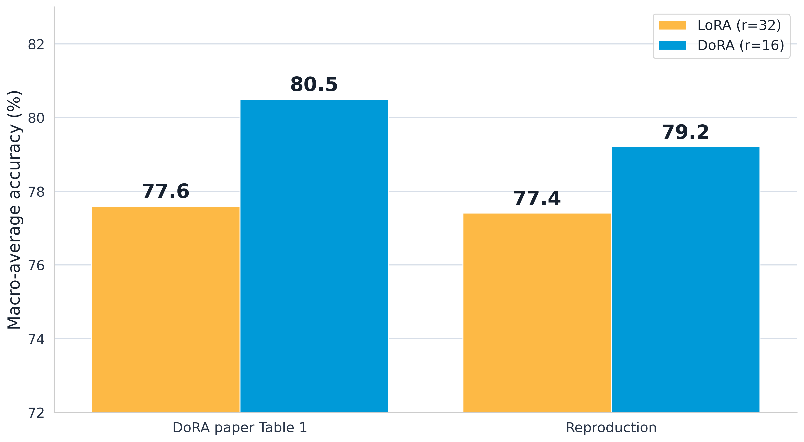

# DoRA Reimplementation for Commonsense Reasoning

## Introduction

This repository contains a CS 4782 / CS 5782 final project reimplementation of *DoRA: Weight-Decomposed Low-Rank Adaptation*. The paper's main contribution is a parameter-efficient fine-tuning method that separates weight magnitude from direction, improving LoRA-style adaptation while training fewer parameters.

## Chosen Result

We target the paper's commonsense reasoning result from Table 1, where rank-halved DoRA improves average accuracy over LoRA on BoolQ, PIQA, Social IQA, HellaSwag, WinoGrande, ARC-Easy, ARC-Challenge, and OpenBookQA. We also include attention-only and MLP-only ablations to test where the DoRA update helps most.

## GitHub Contents

- `code/`: Python package, CLI, tests, configs, and analysis script for the reimplementation.
- `data/`: the 15k commonsense training set, normalized benchmark files, and dataset notes.
- `results/`: checked-in figures/tables used by the README, poster, and report.
- `poster/`: final poster PDF plus the LaTeX source used to build it.
- `report/`: placeholder for the final report PDF.
- `code/notebooks/`: the primary Colab notebook used to run the GPU reproduction.

## Re-implementation Details

The implementation uses Hugging Face `transformers` for model/tokenizer loading and repo-owned PyTorch modules for LoRA/DoRA adapter injection, checkpointing, and evaluation. The default practical setup fine-tunes `meta-llama/Llama-2-7b-hf` on `data/commonsense_15k.json`, evaluates eight commonsense tasks, and compares `lora` vs `dora` across `full`, `attention_only`, and `mlp_only` adapter scopes.

Compared with the original paper, this repo uses student-scale compute choices: a 15k training subset instead of the full 170k set, adapter-only checkpoints, 3 epochs, cutoff length 256, seed 42, Colab-focused 4-bit runtime settings, and additional scope ablations. The main paper-style comparison uses LoRA at rank 32 with learning rate `3e-4` against rank-halved DoRA at rank 16 with learning rate `2e-4`.

The main reproduction path is Google Colab, matching how these results were produced. Open `code/notebooks/colab_quickstart.ipynb`, choose **Runtime > Change runtime type**, and select a GPU runtime before running the training cells. Use an A100 runtime when available with `--runtime colab_a100_40gb_llama`; use `colab_l4_llama` for L4 runtimes and `colab_t4_llama` for smaller T4 runtimes. Store `HF_TOKEN` in the Colab environment for gated LLaMA access, then keep checkpoints and Hugging Face caches on Drive so long jobs survive runtime resets.

## Reproduction Steps

Primary path: run the Colab notebook in `code/notebooks/colab_quickstart.ipynb`. In Colab, mount Google Drive, set `HF_TOKEN` for gated LLaMA access, select the available GPU runtime, and run the notebook cells in order. The notebook prepares assets, trains/evaluates adapters, and writes run outputs under `results/runs/`.

Equivalent CLI setup for local development or for reproducing the notebook commands manually:

```bash
uv sync --all-groups
uv run python -m dora_repro.cli prepare-assets --models tiny_debug --cache-dir data/cache
```

For gated LLaMA runs, set `HF_TOKEN` or `HF_TOKEN_PATH`, then train one adapter:

```bash
uv run python -m dora_repro.cli train \
  --model llama2_7b \
  --method dora \
  --scope full \
  --runtime colab_a100_40gb_llama \
  --experiment paper_colab
```

Evaluate and summarize a completed run:

```bash
uv run python -m dora_repro.cli evaluate --run-dir results/runs/<run_name>
uv run python -m dora_repro.cli summarize --results-dir results/runs --output-dir results/summary
```

Run the six main variants by combining `--method {lora,dora}` with `--scope {full,attention_only,mlp_only}`. Colab with an A100-class GPU is the preferred setup for 7B runs; `tiny_debug` is intended only for local smoke tests.

Quality checks:

```bash
uv run ruff format --check .
uv run ruff check .
uv run ty check code/src
uv run pytest
```

## Results/Insights

The checked-in Llama-2-7B reproduction results are in `results/summary_table.csv`, with additional breakdowns in `results/scope_summary.csv` and `results/task_summary.csv`. Full-scope, rank-halved DoRA improves over LoRA from `0.7741` to `0.7920` macro accuracy, a gain of about `+1.79` points while reducing trainable parameters from `0.83%` to `0.43%`. Attention-only DoRA underperforms LoRA by about `-1.50` points; MLP-only DoRA is roughly tied, at about `+0.15` points.





The main paper-level claim partially reproduces in the full-scope setting: DoRA beats LoRA in the same direction as the official result, although our `79.20%` DoRA score remains below the paper's `80.5%` reference. The rank-scaling and scope ablations suggest that LoRA remains strong at higher ranks, but DoRA works best when applied broadly across the transformer rather than isolated to only attention or MLP projections.

## Conclusion

DoRA achieves higher accuracy than LoRA in the full-scope setting while using fewer trainable parameters, supporting the paper's central claim at student-project scale. The ablations also show that DoRA works best when applied broadly across the transformer instead of only to attention or MLP layers.

## References

1. Shih-Yang Liu et al. [*DoRA: Weight-Decomposed Low-Rank Adaptation*](https://arxiv.org/abs/2402.09353). ICML 2024 Oral.
2. [NVlabs/DoRA official implementation](https://github.com/NVlabs/DoRA).
3. Edward Hu et al. [*LoRA: Low-Rank Adaptation of Large Language Models*](https://arxiv.org/abs/2106.09685).
4. [Hugging Face Transformers documentation](https://huggingface.co/docs/transformers).

## Acknowledgements

This repository was prepared for the CS 4782 / CS 5782 Intro to Deep Learning final project at Cornell University, Spring 2026. We acknowledge the original DoRA authors and NVlabs for releasing the paper, implementation notes, and commonsense reasoning reference results.
