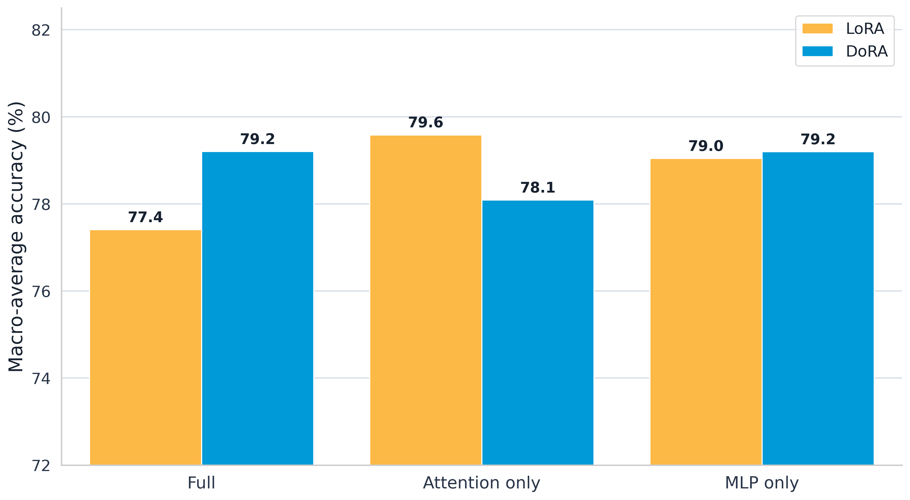
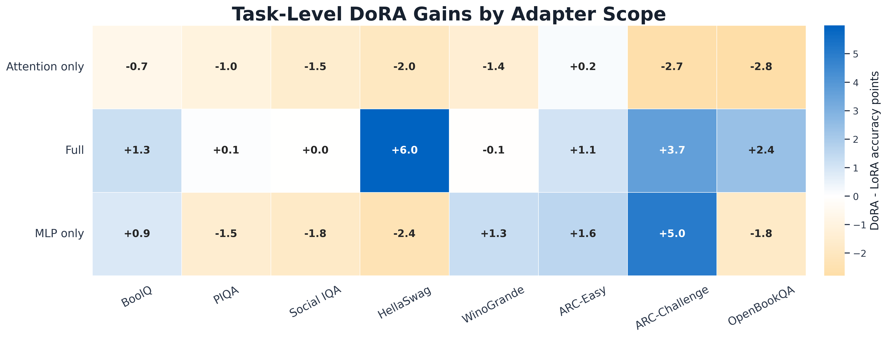
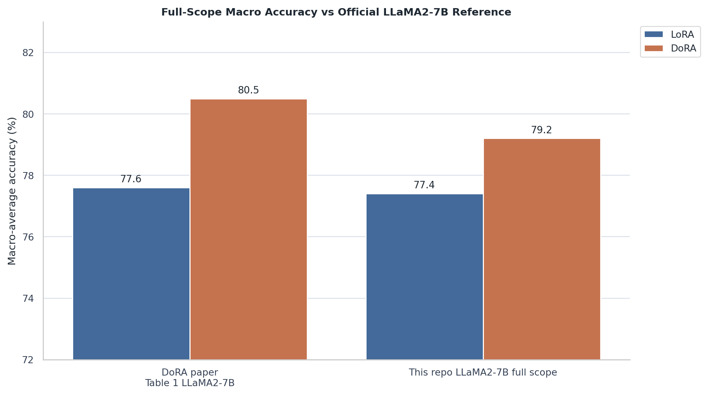
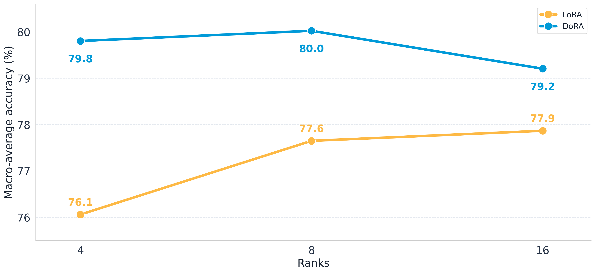

# Reproducing DoRA for Commonsense Reasoning with Student-Scale Compute

**Ian Holloway, Younghyun Jung, Swathi Saravana Selvam, Shashwat Modi**  
Cornell University - CS 5782 / CS 4782 Intro to Deep Learning

## Main Takeaway

Full fine-tuning is expensive. LoRA made fine-tuning cheaper by training low-rank updates, and DoRA pushes that idea further by separating magnitude from direction. In our commonsense reasoning reproduction, full-scope DoRA improved over LoRA while using fewer trainable parameters, and the ablations show that the gain depends strongly on where adapters are applied.

## Motivation

- Full fine-tuning large language models is expensive in memory, storage, and training time.
- LoRA reduced that cost by training low-rank adapter updates while freezing the base model.
- DoRA makes fine-tuning even cheaper by decomposing pretrained weights into magnitude and direction.
- Our goal was to maximize fine-tuning performance with DoRA while using fewer parameters.
- We also tested whether DoRA beats LoRA at the same rank and whether it helps most in attention layers, MLP layers, or only when applied broadly.

## Paper Idea

- Paper: *DoRA: Weight-Decomposed Low-Rank Adaptation*.
- Core method: decompose each pretrained weight into magnitude and direction.
- DoRA adapts direction with a LoRA-style low-rank update and learns magnitude separately.
- The paper reports that DoRA improves over LoRA across language and vision-language tasks.
- Chosen result: reproduce the LLaMA2-7B commonsense reasoning comparison from the DoRA paper's Table 1 / official commonsense results.

## Methodology

- Base model: `meta-llama/Llama-2-7b-hf`.
- Training data: `data/commonsense_15k.json`, a student-scale subset of the larger commonsense training set.
- Evaluation tasks: BoolQ, PIQA, Social IQA, HellaSwag, WinoGrande, ARC-Easy, ARC-Challenge, OpenBookQA.
- Metrics: per-task accuracy and macro-average accuracy across all eight tasks.
- Implementation: from-scratch PyTorch LoRA and DoRA adapter layers injected into Hugging Face model modules.
- Training setup: frozen base model, adapter-only checkpoints, 3 epochs, sequence cutoff 256, deterministic generation-based evaluation.
- Controlled comparison: all LoRA/DoRA runs used the same model, 15k data subset, tasks, prompt/eval pipeline, seed 42, and adapter-only training. Method-specific settings followed the paper-style config: LoRA r=32, LR=3e-4; rank-halved DoRA r=16, LR=2e-4.
- Colab setup: 4-bit NF4 quantized runtime presets for T4, L4, and A100 GPUs.

## Experiments

We compared LoRA and DoRA under matched adapter scopes:

Motivation: this ablation tests whether DoRA's gain comes from attention layers, MLP layers, or coordinated updates across both.

| Scope | Target Modules | Purpose |
| --- | --- | --- |
| Full | `q_proj`, `k_proj`, `v_proj`, `up_proj`, `down_proj` | Paper-level reproduction setting |
| Attention-only | `q_proj`, `k_proj`, `v_proj` | Test whether routing/context layers benefit most |
| MLP-only | `up_proj`, `down_proj` | Test whether feed-forward/factual layers benefit most |

## Results

**Figure 1.** Rank-halved DoRA improves full-scope macro accuracy from **77.4% to 79.2%**, but does not improve over the same-scope LoRA baseline in the attention-only setting.

**Figure 2.** Full-scope DoRA improves **6/8 tasks**, ties Social IQA, and slightly loses on WinoGrande. The largest full-scope gains are HellaSwag **+6.0**, ARC-Challenge **+3.7**, and OpenBookQA **+2.4** accuracy points. DoRA's benefit appears scope-dependent, not automatic.

**Figure 3.** Our reproduction captures the paper's direction: rank-halved DoRA improves over LoRA, but our 79.2% DoRA score remains below the official 80.5% reference.

| Adapter Scope | LoRA Macro Accuracy | DoRA Macro Accuracy | DoRA - LoRA |
| --- | ---: | ---: | ---: |
| Full | **77.41%** | **79.20%** | **+1.79 pts** |
| Attention-only | **79.59%** | **78.09%** | **-1.50 pts** |
| MLP-only | **79.05%** | **79.20%** | **+0.15 pts** |

## Rank Comparison

Macro-average accuracy across rank sizes, with the DoRA advantage shown in the lower panel.

## Conclusion

- Full-scope DoRA improved macro-average accuracy by **+1.79 points** over LoRA under our student-scale setup while using fewer trainable parameters.
- The reproduction supports the claim that DoRA can improve parameter-efficient fine-tuning, not just reduce its cost.
- LoRA is still strong at higher ranks, so the advantage is not universal across all adapter sizes.
- The best results came from applying DoRA broadly across the transformer rather than only to one module group.
- Validation: `uv run pytest -q` passed with **59 passed, 1 skipped**.

## Future Work

- Train on the full `commonsense_170k.json` dataset instead of the 15k subset.
- Repeat the LoRA and DoRA variants across multiple random seeds.
- Test more layer-placement variants, especially attention-only LoRA, to understand why it scored highest in some runs.
- Recheck the rank comparisons at full scale so the performance trend across ranks is better verified.

## References

1. Shih-Yang Liu, Chien-Yi Wang, Hongxu Yin, Pavlo Molchanov, Yu-Chiang Frank Wang, Kwang-Ting Cheng, and Min-Hung Chen. *DoRA: Weight-Decomposed Low-Rank Adaptation*. ICML 2024 Oral. <https://arxiv.org/abs/2402.09353>
2. NVlabs. *DoRA official implementation*. <https://github.com/NVlabs/DoRA>
3. Edward J. Hu et al. *LoRA: Low-Rank Adaptation of Large Language Models*. <https://arxiv.org/abs/2106.09685>
4. Hugging Face. *Transformers documentation*. <https://huggingface.co/docs/transformers>

## Figure Checklist For Poster Layout

- `results/analysis/fig1_macro_grouped.png`  
  Caption: Macro-average accuracy by adapter scope. Best for the main results panel.
- `results/analysis/fig3_dora_gains.png`  
  Caption: DoRA-minus-LoRA task gains. Best for showing insight and independent analysis.
- `results/analysis/fig5_official_comparison.png`  
  Caption: Full-scope reproduction compared with the official LLaMA2-7B reference. Best for reproducing the paper claim.

## 2-3 Minute Verbal Summary

Our project reproduces part of the DoRA paper, which proposes a parameter-efficient fine-tuning method for large models. The motivation is that full fine-tuning is expensive, and LoRA is much cheaper because it trains low-rank updates on top of a frozen model. DoRA modifies this idea by decomposing pretrained weights into magnitude and direction. It keeps a LoRA-style low-rank update for direction, but also learns the magnitude separately.

We focused on the commonsense reasoning result for LLaMA2-7B. We trained LoRA and DoRA adapters on a 15k commonsense training subset, then evaluated eight benchmarks: BoolQ, PIQA, Social IQA, HellaSwag, WinoGrande, ARC-Easy, ARC-Challenge, and OpenBookQA. Our main metric is macro-average accuracy across the eight tasks.

The main reproduction result is that full-scope DoRA improves over full-scope LoRA. LoRA reached 77.41% macro accuracy, while DoRA reached 79.20%, a gain of 1.79 points. This matches the paper's qualitative claim, although our absolute DoRA score is lower than the official reference.

Our independent experiment was to test where DoRA helps. We compared full adapters with attention-only and MLP-only adapters. This gave a more nuanced result: attention-only DoRA underperformed LoRA by 1.50 points, and MLP-only DoRA was basically tied at +0.15 points. The strongest gains appeared when DoRA was applied broadly across attention and MLP modules together.

The takeaway is that DoRA can improve parameter-efficient fine-tuning, but the benefit is not automatic. In our runs, the magnitude/direction decomposition worked best as a full adapter strategy, not as a narrow attention-only replacement. With more time, we would train on the full 170k commonsense dataset, repeat across seeds, and investigate the attention-only failure mode in more detail.

## Likely Reviewer Questions

**What did you reproduce from the paper?**  
We reproduced the commonsense reasoning trend that DoRA should outperform LoRA on LLaMA2-7B average accuracy.

**Did your result match the official number exactly?**  
No. Our full-scope DoRA reached **79.20%** macro accuracy, while the official LLaMA2-7B DoRA reference reports **80.5%**. We matched the direction of improvement but not the exact score.

**Why might your score differ from the paper?**  
We used a student-scale 15k training subset, Colab-focused quantized runtimes, and a local reimplementation rather than the exact full official training setup.

**What was your independent contribution?**  
We added adapter-scope ablations comparing full, attention-only, and MLP-only LoRA/DoRA runs.

**What was the most surprising result?**  
Attention-only LoRA was strong, but attention-only DoRA was worse than LoRA on 7/8 tasks.

**What is the main conclusion?**  
DoRA helped in the full adapter setting, but isolated layer-scope experiments suggest the method needs coordinated updates across multiple module types.

**What would you improve first with more compute?**  
Run the same six conditions on the full `commonsense_170k.json` dataset and repeat across multiple random seeds.
